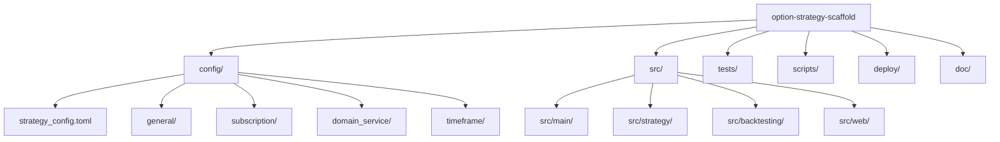
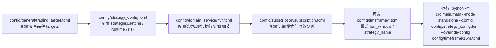
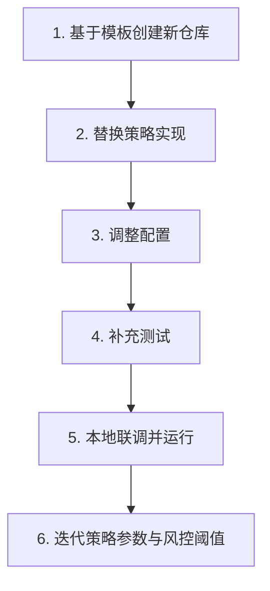

## 1. 项目目录



## 2. 在 config 目录下配置策略的方法



配置顺序建议：
1. 先改 `config/general/trading_target.toml` 的 `targets`，确定要交易的品种。
2. 再改 `config/strategy_config.toml` 的 `[[strategies]]` 与 `[strategies.setting]`（如 `max_positions`、`position_ratio`、`strike_level`、`bar_window`）。
3. 按需改 `config/domain_service/` 下各模块 TOML（`selection`、`risk`、`execution`、`pricing`）。
4. 需要自动订阅收敛时，改 `config/subscription/subscription.toml` 的 `enabled`、`enabled_modes` 等参数。
5. 需要多周期策略时，在 `config/timeframe/` 新建覆盖文件并通过 `--override-config` 传入。

## 3. 以本策略作为模板仓库搭建自己的期权交易策略的指南



落地步骤：
1. 用该仓库创建新仓库（GitHub `Use this template` 或本地 `git clone` 后改远端）。
2. 在 `src/strategy/domain/domain_service/signal/` 实现你的信号逻辑（`IndicatorService`、`SignalService`）。
3. 在 `src/strategy/strategy_entry.py` 保持入口类可用，并确保 `config/strategy_config.toml` 的 `class_name` 与策略参数匹配。
4. 按你的交易标的与风控需求，完整调整 `config/` 下文件（至少 `strategy_config.toml`、`trading_target.toml`、`domain_service/*.toml`）。
5. 在 `tests/strategy/` 与 `tests/main/` 增加或修改对应测试，覆盖开平仓、风控和配置加载。
6. 使用以下命令启动验证：

```bash
python -m src.main.main --mode standalone --config config/strategy_config.toml
```
